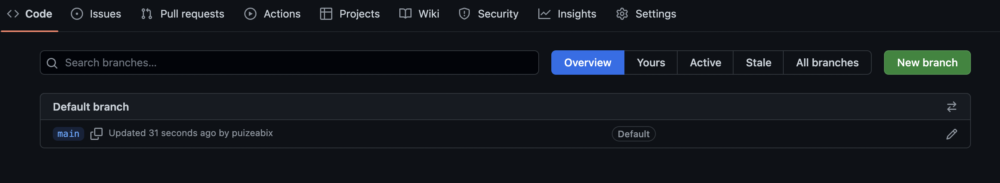
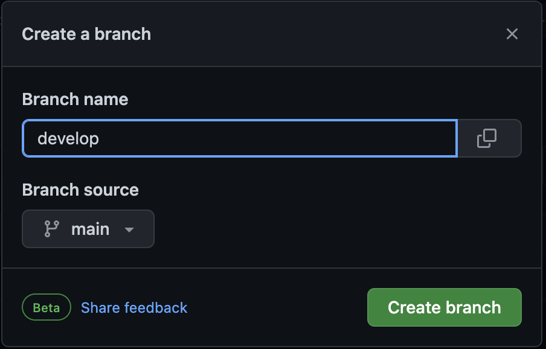
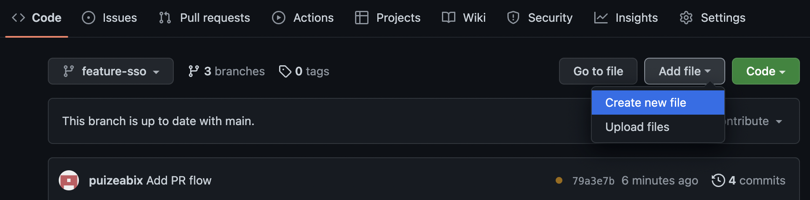
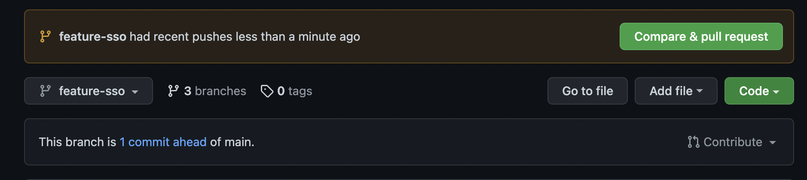
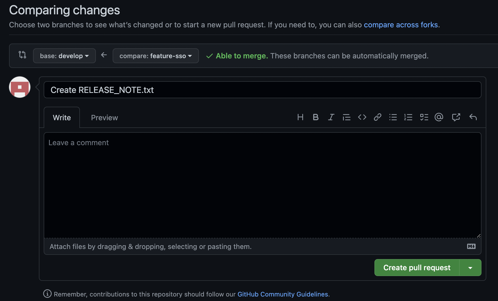
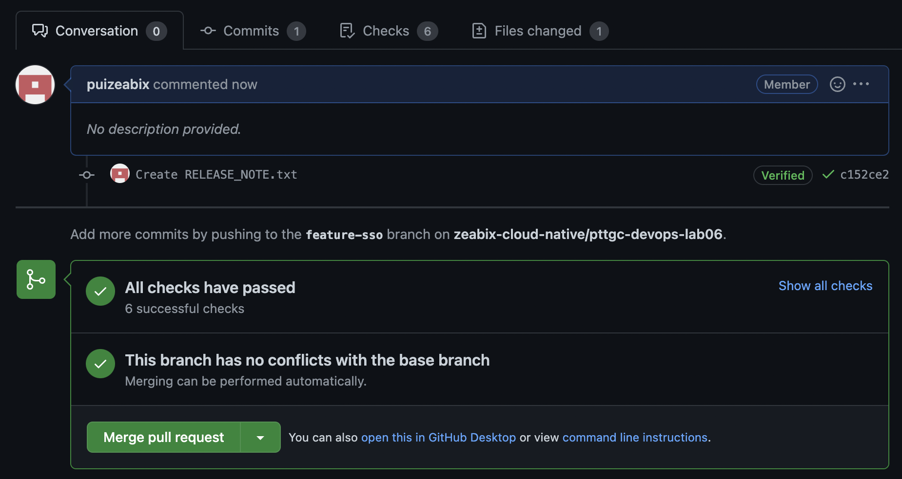
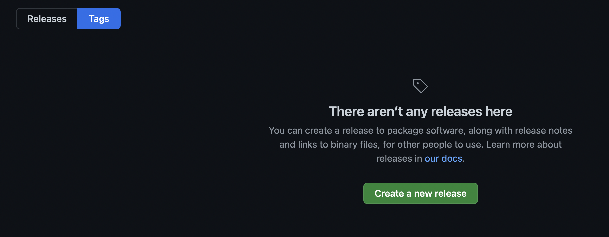
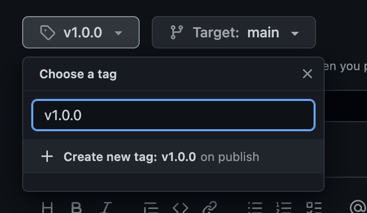

# pttgc-devops-lab06
This module will provide hands on experience to attendee to create the DevOps workflows for shared branch strategy.

## Excercise 1 - Prepare branches for GitFlow

- Create new repository `devops-lab06` and copy every file in this repository to your repository

- Create `develop` branch from `main` branch

- Create `feature-sso` from `develop` branch

- Create some text file on `feature-sso` branch

- Commit and push new file to `feature-sso`

- Create Pull request to merge code back to `develop` branch

- Review and merge code to `develop`

- Check your GitHub Action GUI to see if the workflow running

## Excercise 2 -- Release workflow

- From exercise 1, create new branch `release/v1.0.0` from branch `develop`

- Add new file to `release/v1.0.0` to simulate in case there is a bug need to be fixed before release

- Commit and push that file

- Create Pull Request and merge it to `main` branch

- From `main` branch, Create new release and new tag, Click on `tags`

- Once the release was create, check GitHub Action for the progress

## Discussion
...